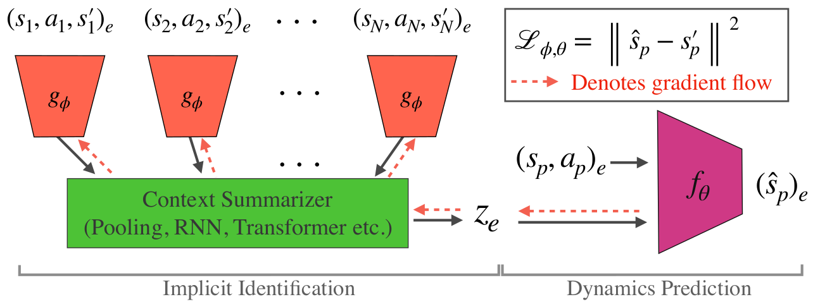

## Context is Everything: Implicit Identification for Dynamics Adaptation

| [Publication](https://bennevans.github.io/publication/iida/) | [Code](https://github.com/bennevans/icra-iida) |
| --- | --- |

### Authors
| Ben Evans | Abitha Thankaraj | Lerrel Pinto |
| --- | --- | --- |

### Abstract 
Understanding environment dynamics is necessary for robots to act safely and optimally in the world. In realistic scenarios, dynamics are non-stationary and the causal variables such as environment parameters cannot necessarily be precisely measured or inferred, even during training. We propose Implicit Identification for Dynamics Adaptation (IIDA), a simple method to allow predictive models to adapt to changing environment dynamics. IIDA assumes no access to the true variations in the world and instead implicitly infers properties of the environment from a small amount of contextual data. We demonstrate IIDA’s ability to perform well in unseen environments through a suite of simulated experiments on MuJoCo environments and a real robot dynamic sliding task. In general, IIDA significantly reduces model error and results in higher task performance over commonly used methods.

### Method

