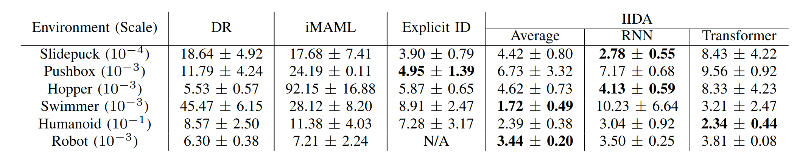
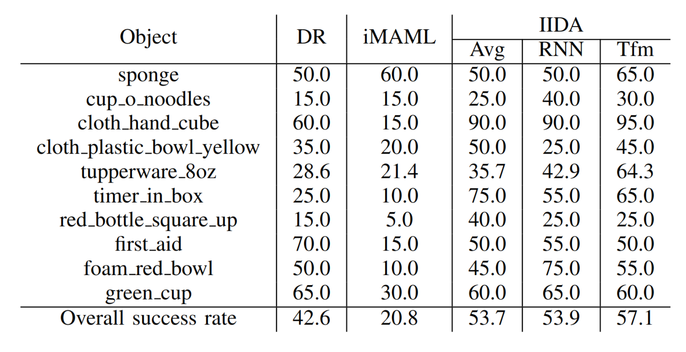
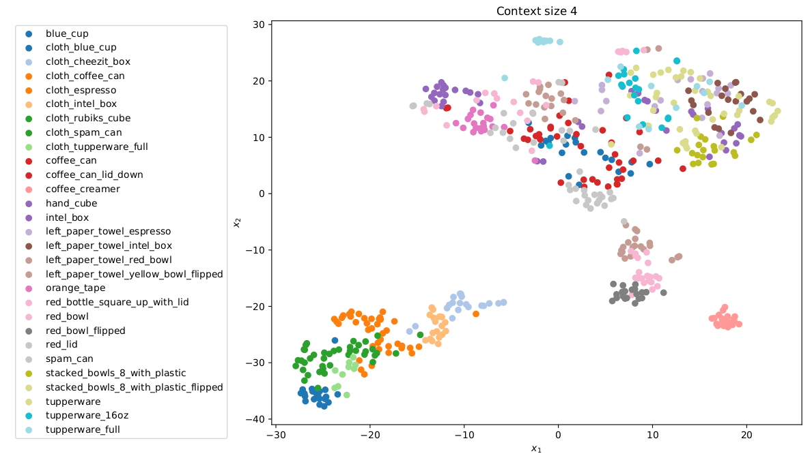

# Context is Everything: Implicit Identification for Dynamics Adaptation

[Publication](https://bennevans.github.io/publication/iida/) &nbsp; &nbsp; [Code](https://github.com/bennevans/icra-iida)

### Authors
**Ben Evans** &nbsp; &nbsp; Abitha Thankaraj &nbsp; &nbsp; Lerrel Pinto
 

## Abstract 
Understanding environment dynamics is necessary for robots to act safely and optimally in the world. In realistic scenarios, dynamics are non-stationary and the causal variables such as environment parameters cannot necessarily be precisely measured or inferred, even during training. We propose Implicit Identification for Dynamics Adaptation (IIDA), a simple method to allow predictive models to adapt to changing environment dynamics. IIDA assumes no access to the true variations in the world and instead implicitly infers properties of the environment from a small amount of contextual data. We demonstrate IIDA’s ability to perform well in unseen environments through a suite of simulated experiments on MuJoCo environments and a real robot dynamic sliding task. In general, IIDA significantly reduces model error and results in higher task performance over commonly used methods.

## Method

IIDA is a method designed to adapt dynamics models to environments with varying dynamics by learning an implicit identification encoder conditioned on (s, a, s') tuples from the current environment, called context. For environments with multiple possible dynamics, the same action can result in vastly different next states, requiring us to adapt our model to the current environment in order to predict well. By backpropagating the gradients of single-step loss from the dynamics model to the encoder, the encoder is encouraged to learn information useful for predicting the next state, and thus learns to implicitly identify the environment it is in.

## Results
We evaluate IIDA on a number of simulated experiments, as well as a real robot experiment. IIDA outperforms baselines and even beats models with access to the true environment dynamics parameters in most cases.

|  | 
| :-------------------------:|
| Mean squared error and std over 3 seeds |

|  | 
| :-------------------------:|
| Success rate for the robot sliding task |

We visualize the latent space learned on the robot sliding dataset using tSNE and see that it is learning self-consistient latents with similar objects close together in latent space.

